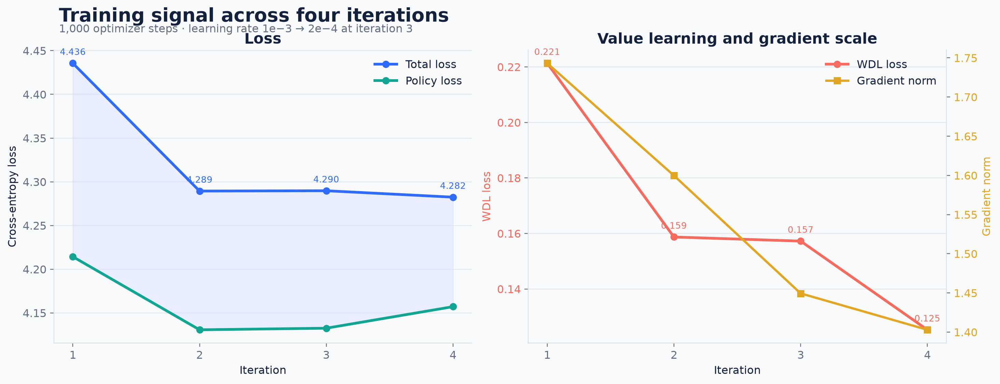
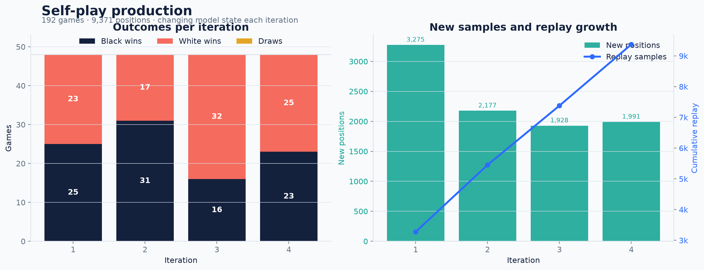
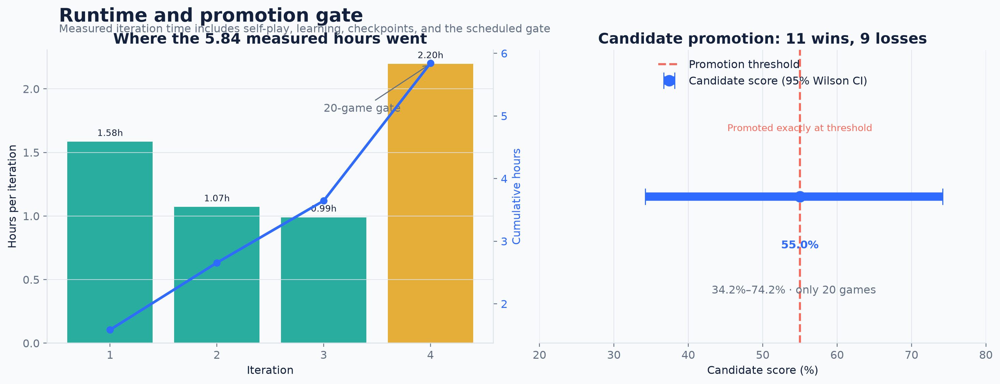

# Eight-hour bounded run / 8 小时限时训练

This directory is the immutable, repo-sized report for the completed Vertex AI run `eight-hour-6c41a4d-20260817`. The job succeeded in **5 h 50 m 35 s** on one CPU-only `n1-highcpu-32` worker. It executed the configured four iterations and stopped normally; “eight hour” was the outer time budget, not a promise to consume all eight hours.

本目录记录 Vertex AI 上已完成的 `eight-hour-6c41a4d-20260817` 限时训练。任务在单台 CPU `n1-highcpu-32` 上运行 **5 小时 50 分 35 秒**并成功结束，按配置完成四轮迭代；“8 小时”是上限，不代表必须跑满。

## Result snapshot / 结果快照

| Item | Observed result |
|---|---:|
| Vertex job | `5055443138961735680` — `JOB_STATE_SUCCEEDED` |
| Source revision | `6c41a4d25986b3b44f8effde1fc62f400ac8eb12` |
| Self-play | 192 games (48 × 4), 9,371 positions |
| Search per self-play move | 800 MCTS simulations |
| Optimization | 1,000 steps, minibatch 256 |
| Inference batching during self-play | **1 position per network call** |
| Color outcomes across changing models | black 95 / draw 0 / white 97 |
| Final losses | total 4.2824 / policy 4.1571 / WDL 0.1253 |
| Promotion gate | candidate 11–9, score 55%, threshold 55% |
| Promotion uncertainty | 95% Wilson interval 34.2%–74.2% |
| Checkpoints | 4 versioned states + `latest.pt` alias |
| Final model | `model/model.pt`, 64,980,229 bytes |
| Public deployment | `gomoku-zero-00003-v6j` |







## How to read the result / 如何理解

The total loss fell from 4.4356 to 4.2824, WDL loss fell from 0.2213 to 0.1253, and gradient norm fell from 1.7431 to 1.4029. These are useful signs that the learner updated successfully; four measurements are not enough to claim convergence. Iteration 4 is slower because its recorded time includes the scheduled 20-game promotion gate.

总损失、WDL 损失和梯度范数均下降，说明训练链路确实产生了更新，但四个观测点不足以证明收敛。第四轮耗时明显上升，是因为该轮还包含 20 局串行晋级赛。

The 55% promotion result is exactly on the configured threshold and therefore promoted the candidate. It is weak evidence: with only 20 games, the 95% Wilson interval spans roughly 34%–74%. The 95 black wins and 97 white wins are self-play data produced by four changing model states, not an evaluation of one frozen model.

55% 的晋级分数恰好达到阈值，因此候选模型被晋级；但只有 20 局，置信区间很宽。自博弈的黑 95 / 白 97 混合了四个不同训练阶段，不能当作冻结模型的先手胜率。

## Batch-size distinction / 两种 batch size

This run used optimizer minibatch **256** for SGD, but self-play neural inference was still **batch 1**: every MCTS leaf caused a separate `[1, 3, 15, 15]` network call. Twenty-eight CPU actor processes added concurrency, but did not create a single large accelerator-friendly inference batch. The raw report therefore preserves both values explicitly; treating them as the same “batch size” would hide the main scaling bottleneck.

本次 SGD 训练的 minibatch 是 **256**，但 MCTS 自博弈推理仍是 **batch 1**：每个叶节点单独调用一次 `[1, 3, 15, 15]` 网络。28 个 CPU actor 只提供进程并发，并没有合并成适合 GPU 的大批量推理。这两个数字含义不同。

## Checkpoint semantics / Checkpoint 口径

There are **four independently named checkpoint states**: `iteration-0001.pt` through `iteration-0004.pt`. `checkpoints/latest.pt` is the mutable final/resume alias and does not count as a fifth state. The promoted serving artifact `model/model.pt` is byte-identical to `latest.pt` in this run. PyTorch serialized `iteration-0004.pt` independently, so its file hash differs even though it represents the same final iteration.

共有 **4 个按迭代命名的 checkpoint 状态**。`latest.pt` 是最终/恢复别名，不是第 5 个状态。本次 `model/model.pt` 与 `latest.pt` 字节相同；`iteration-0004.pt` 是独立序列化文件，因此文件哈希不同。

## Reproducibility / 可复现材料

- [`config.json`](config.json): exact bytes copied from GCS `config.production.json`.
- [`metrics.jsonl`](metrics.jsonl): exact per-iteration metrics.
- [`self-play/`](self-play/): four immutable, 48-game provenance manifests; model weights and replay tensors are intentionally not committed.
- [`summary.json`](summary.json): machine-readable job, metrics, hashes, artifact metadata, and limitations.
- [`plot_results.py`](plot_results.py): regenerates the checked-in PNG/SVG figures from `metrics.jsonl` after verifying its SHA-256.

The checked-in figures were generated with CPython 3.11.15, Matplotlib 3.11.1,
and Pillow 12.3.0. Recreate them without changing the project lockfile:

```bash
uv run --python 3.11 --with matplotlib==3.11.1 \
  python docs/experiments/eight-hour-20260817/plot_results.py
```

Run URI: `gs://gomoku-zero-20260816-ai-training/runs/eight-hour-6c41a4d-20260817`

Generation-pinned model URI: `gs://gomoku-zero-20260816-ai-training/runs/eight-hour-6c41a4d-20260817/model/model.pt#1786921835981242`

Final model SHA-256: `b82cb09cb163ef32986fe602ae3c2026a08b76e25ca3229534fc218c90b86137`

The raw-file SHA-256 values and every GCS object checksum used here are in [`summary.json`](summary.json). `config_semantic_sha256` is the canonical JSON digest embedded in each self-play record; `config_file_sha256` is the digest of the original formatted file, so the two are intentionally different.

## Online deployment / 线上部署

The promoted artifact is live at [gomoku-zero-313049501255.asia-southeast1.run.app](https://gomoku-zero-313049501255.asia-southeast1.run.app) on Cloud Run revision `gomoku-zero-00003-v6j`. The serving image was built from source commit `1aff963ac66893f057c30368f560e13cc74aa2c5` and pinned to digest `sha256:3b7cfe9645afcca357b86bc4566a25777de8a22fb55ab63ebd3dca0c056a1725`. The deployed model object is generation `1786921835981242`, 64,980,229 bytes, SHA-256 `b82cb09cb163ef32986fe602ae3c2026a08b76e25ca3229534fc218c90b86137`.

As a serving smoke test, one empty-board request with the **instant 40-simulation** budget returned D5 and the model/search estimate black 55.75277%, draw 0.01781%, white 44.22942%. This verifies that the promoted checkpoint is answering requests. It is one low-budget model/search estimate—not an independent match set, a calibrated opening win rate, or a game-theoretic result.

晋级模型已部署到上述公开地址。空棋盘、40 次模拟的单次线上冒烟测试返回 D5，估计黑 55.75277%、和 0.01781%、白 44.22942%。这只验证线上模型能正常推理，不能替代独立评估，也不是五子棋数学真值。

## Limits / 不应得出的结论

This run contains **192 self-play games and 20 promotion games**. It is not the previously proposed 20,000–50,000-game training program, and it does not contain a 6,000-game independent evaluation of a frozen final model. It cannot establish a mathematical black-win probability or prove that 800-search MCTS is globally sufficient. Promotion at the threshold is a deployment gate result, not proof of engine strength.

本实验不是 2–5 万局正式训练，也没有对冻结最终模型做 6,000 局独立评估；因此不能证明数学意义上的黑方胜率，不能证明 800 次搜索在所有局面都足够，也不能把一次刚好过线的晋级结果当成棋力证明。
